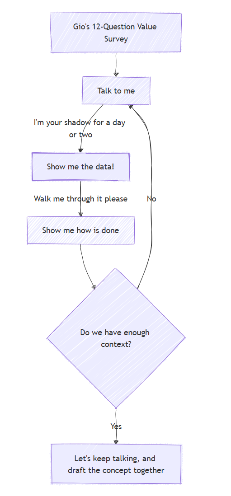

# About Giovanni

Originally from **Morelia, Mexico**, calling **Zürich Unterland, Switzerland** home for a while now, where I split my time between speaking data and playing on bikes.

---

## Who I Am

- **Background:** Mechanical engineer turned data professional, with experience across aviation, healthcare, and digital platforms.  
- **Passion:** Building meaningful data products, from analytics dashboards to full-stack data apps.  
- **Culture:** Multicultural by nature. I thrive in international teams scaling-up where perspectives collide and ideas spark.  
- **Energy source:** A mix of good espresso and trail rides, surrounded by positive and collaborative people.

---

## Beyond the SQL and Bar Charts

I’m a certified **Swiss Cycling Guide** running [BikeFlow](https://www.bikeflow.ch/){:target="_blank"} , where I teach kids and adults the joy of balance and movement on two wheels.  

---

## What Drives Me

> **Curious, open, cooperative, and balanced.**  
> Energized by learning, creating, and supporting others to achieve clarity and purpose.

These values shape how I build: through collaboration, flexibility, and a constant desire to improve systems, human and digital alike.

---

## My Toolbox recently

| Discipline | Tools & Tech |
|-------------|--------------|
| Data Engineering | Python • SQL • AWS • Matillion • Postgres • Kafka  |
| Analytics & Tracking | GA4 • GTM • Tealium • Adobe Analytics |
| Visualization | Streamlit • Matplotlib • Tableau |
| Infrastructure | AWS • Ansible • Jenkins • Docker • GitHub|
| Soft Skills | Mentoring • Storytelling • Cross-functional collaboration |

---

## My Data First Approach

Over the last couple years, when tackling data projects, either to create a data product, a pipeline or BI-Layer, I have developed a simple  process that helps me kick-off the conversation.

> Check the [12-Question Value Survey](./projects/gios_twelve_questions_value_survey.md)

---

Or Jump to my [Résumé](./cv/index.md)
