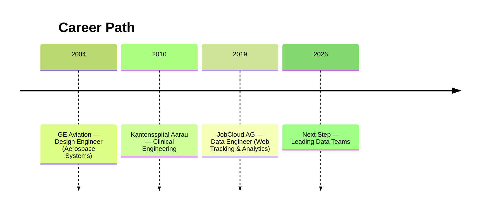

# Giovanni's Résumé

Welcome to the data version of my professional story that is modular, versioned, and open for exploration.  
Here you’ll find tailored views of my experience, projects, and career evolution.

---

**{{ cv.title }}**  
{{ cv.location }}  
📧 [{{ cv.email }}](mailto:{{ cv.email }})  
📞 {{ cv.phone }}

---

## Summary

{{ cv.summary }}

---

## Professional Journey

<!--

-->

### Talking Data, Charts and SQL

> JobCloud AG (2019–Present)

Here is a story, of my current Data Engineer Chapter. When the company adopted a shiny new tool for web tracking, I took the task to build the bridge between raw event data and meaningful business insight.

The goal was straight-forward, and a bit daunting as well, connecting, modeling, and visualizing data from hundreds of columns and millions of daily events. It first felt like staring at an ocean too wide to cross. But repetition, curiosity, and patience turned that chaos into fluency.

About three or four months later after starting the project, I was not just maintaining the system but explaining it, becoming the go-to person for clarity in the noise.

After a while, what was once a dense, huge and unreadable dataset, the project became a living conversation and rows turned into rhythm, numbers into understanding.

#### Highlights

- Built a full web-tracking model powering dashboards and KPIs across departments.
- Became the focal point for all web-tracking data-knowledge and support.
- Translated complexity into confidence, for myself and my peers.

#### Flops (and lessons)

- Underestimated the weight (technically and even emotionally) of large-scale data early on.
- Delayed asking for help. Learned collaboration saves time and sanity.
- Over-engineered early iterations before discovering the beauty of simplicity.

#### Growth

- Learned that perseverance and curiosity beat panic.
- Embraced “beginner’s mind” as a leadership tool.
- Found joy in turning data into dialogue.

### The Medical Devices Years

> Kantonsspital Aarau AG (2010–2018)

I arrived from a world of machines, simulations, technical substantiations, CAD and finite element methods into the living intensity of a hospital. The corridors were bright, sterile, and full of motion. Machines humming, alarms beeping, people moving with purpose. The stakes were higher than any previous engineering challenge I've had. Here, failure had an immediate consequence that you could feel, right there, in front of you.

The early days were tough. A new country, a new language, and a job where both precision and empathy mattered equally. But day after day, through patient observation and morning rounds with ICU staff, I managed to earn trust, fixing what broke, listening to those who knew the rhythms of the ward, and building what I could that quietly made work easier.

Over time, the hospital became less foreign and more like an orchestra I could more-or-less understand, with each machine, person, and system playing its part. By the end, it felt that my contributions were actually making a difference.

On those late stages of my time at the hospital, I remember walking the hall at dawn, with a sort of quiet confidence beneath the hum of machines, smiling back at the small nod of gratitude from the people leaving the shift, a simple acknowledgment that the day can begin because the all systems and devices are working as they should.

#### Highlights

- Modernized medical device management from spreadsheets to modern-tool-based processes.
- Built early Python and data tools to streamline incident tracking and reporting (Here is where I kind of started my Data Journey)
- Earned trust and belonging through reliability, empathy, and perseverance.

#### Flops (and lessons)

- Underestimated the challenge of language and emotional weight of clinical work.
- Initially too focused on technical systems instead of human systems.
- Learned that patience and daily communication create more value than rapid fixes.

#### Growth

- Discovered that real impact lives at the intersection of people and data.
- Developed a calm, service-oriented mindset under pressure.
- Built empathy as an engineering principle, not just a personal trait.

## Education



- **{{ ed.program }}**, {{ ed.institution }} ({{ ed.years }})
  


## Personality at Work

> “Giovanni is both analytical and open — he thrives where logic meets creativity.”

- Quick to decide, yet thoughtful in judgment.
- Flexible problem solver with humor and optimism.
- Likes turning complex technical data into accessible stories.

---
Jump to [Projects](../projects/index.md)
