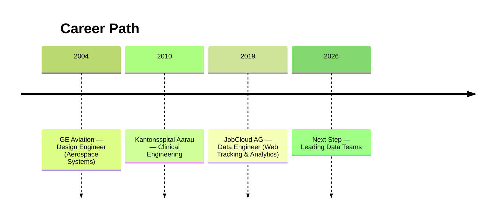

# Giovanni's Résumé

Welcome to the data version of my professional story that is modular, versioned, and open for exploration.  
Here you’ll find tailored views of my experience, projects, and career evolution.

---

**{{ cv.title }}**  
{{ cv.location }}  
📧 [{{ cv.email }}](mailto:{{ cv.email }})  
📞 {{ cv.phone }}

---

## Summary

{{ cv.summary }}

---

## Professional Journey

<!--

-->

Across three very different worlds, aircraft engines, hospital ICUs, and online platforms, all them sharing the same engineering fundamentals (`you'd better know what you're doing`), I tend to reflect of my story as one of adaptation, curiosity, and quiet leadership.

In my sometimes too idealistic and optimistic perspective, I aim to turn complexity into clarity, pressure into calm rhythm, and tools into value.

Every chapter left a lesson and together, they have formed me, with a sense of engineering rigor, an intent for human empathy, and a craftsman’s mindset.

### Talking Data, Charts and SQL

> JobCloud AG (2019–Present)

Here is a story, of my current Data Engineer Chapter. When the [company](https://www.jobcloud.ch/c/en/){:target="_blank"} adopted a shiny new tool for web tracking, I took the task to build the bridge between raw event data and meaningful business insight.

The goal was straight-forward, and a bit daunting as well, connecting, modeling, and visualizing data from hundreds of columns and millions of daily events. It first felt like staring at an ocean too wide to cross. But repetition, curiosity, and patience turned that chaos into fluency.

About three or four months later after starting the project, I was not just maintaining the system but explaining it, becoming the go-to person for clarity in the noise.

After a while, what was once a dense, huge and unreadable dataset, the project became a living conversation and rows turned into rhythm, numbers into understanding.

#### Highlights

- Built a full web-tracking model powering dashboards and KPIs across departments.
- Became the focal point for all web-tracking data-knowledge and support.
- Translated complexity into confidence, for myself and my peers.

#### Flops (and lessons)

- Underestimated the weight (technically and even emotionally) of large-scale data early on.
- Delayed asking for help. Learned collaboration saves time and sanity.
- Over-engineered early iterations before discovering the beauty of simplicity.

#### Growth

- Learned that perseverance and curiosity beat panic.
- Embraced “beginner’s mind” as a leadership tool.
- Found joy in turning data into dialogue.

### The Medical Devices Era

> Kantonsspital Aarau AG (2010–2018)

I arrived from a world of machines, simulations, technical substantiations, CAD and finite element methods into the living intensity of a hospital. The corridors were bright, sterile, and full of motion. Machines humming, alarms beeping, people moving with purpose. The stakes were higher than any previous engineering challenge I've had. Here, failure had an immediate consequence that you could feel, right there, in front of you.

The early days were tough. A new country, a new language, and a job where both precision and empathy mattered equally. But day after day, through patient observation and morning rounds with ICU staff, I managed to earn trust, fixing what broke, listening to those who knew the rhythms of the ward, and building what I could that quietly made work easier.

Over time, the hospital became less foreign and more like an orchestra I could more-or-less understand, with each machine, person, and system playing its part. By the end, it felt that my contributions were actually making a difference.

A fundamental contributtion to my growth, adaptation and consolidation these years was due to the fact that I had a great mentor and the most inspiring leader, [Ullrich Römmelt](https://www.linkedin.com/in/ullrich-r%C3%B6mmelt-116a4a26b/){:target="_blank"}. He gave me the opportunity to learn and expand my boundaries in all directions, and fully trusted my judgement and approach, every single day I worked with him.

On those late stages of my time at the hospital, I remember walking the hall at dawn, with a sort of quiet confidence beneath the hum of machines, smiling back at the small nod of gratitude from the people leaving the shift, a simple acknowledgment that the day can begin because all systems and devices are working as they should.

#### Highlights

- Modernized medical device management from spreadsheets to modern-tool-based processes.
- Built data tools and products to streamline incident tracking and reporting (Here is where I jump-started my Data Journey)
- Earned trust and belonging through reliability, empathy, and perseverance.

#### Flops (and lessons)

- Underestimated the challenge of language and emotional weight of clinical work.
- Initially too focused on technical systems instead of human systems.
- Learned that patience and daily communication create more value than rapid fixes.

#### Growth

- Discovered that real impact lives at the intersection of people and data.
- Developed a calm, service-oriented mindset under pressure.
- Built empathy as an engineering principle, not just a personal trait.

### For starters, some real Rocket Science!

> GE Aviation (2004–2010)

Fresh out of university, I stepped into [GE Aviation](https://www.geaerospace.com/){:target="_blank"} with the kind of pride you can feel in your chest. After months of rejections on countless applications, I finally got the call, the kind that makes you phone your mother and say, “Ma, I’m really an engineer now.” GE wasn’t just a job; it felt like a doorway into a bigger world.

And then something even bigger happened: I was accepted into the [EDISON Engineering Development Program](https://careers.geaerospace.com/global/en/edison-engineering-development-program){:target="_blank"}, a rotating two-year journey through different departments. It promised growth, challenge, and the kind of exposure that young engineers dream of. I walked into the office feeling like I was stepping onto a launchpad.

But the launchpad was steep.

The weekly EDISON homework packs were dense, technical, sometimes cryptic: fluid mechanics, tolerances, material science, numerical methods, bolted joints, fracture mechanics. Just understanding the problem statements felt like its own assignment. This wasn’t university anymore, this was a world where mistakes had consequences, where a forgotten parameter could ripple out into the safety of an aircraft engine.

And then there was the senior engineer, blunt, harsh, relentless, who insisted in a truth I kind of sill carry today:

“Follow the process. Diligence isn’t only about correctness.
It protects you, and everyone else.”

That was the moment I realized engineering wasn’t just math or CAD models.
It was responsibility. Integrity. Rigor.

Things shifted years later, during one of my assigments into Repair Engineering. Here, nothing was theoretical. If a fuel hose bracket had a 0.2 mm crack when the manual only defined repairs for 0.18 mm, someone needed to write the repair, justify it, substantiate it, sign their name under it. That someone was me, along with my wonderful teammates, with some of them becoming my friends, for life.

Enter [Shane Tucker](https://www.linkedin.com/in/christopher-shane-tucker-67a2b594/){:target="_blank"}, mentor, guide, and unexpected North Star.
Together on late calls, I walked with Shane through each repair, each rationale, each decision. And at some point, I  noticed something new in his voice: certainty. Ownership.
I wasn’t guessing anymore. I could explain everything, every limit, every consideration, every step, and I understood why it mattered.

I left those conversations feeling armored, carrying a toolbox of thinking I could apply anywhere. I felt tiny in the scale of GE… but solid in my growing ability to navigate it.

On my final year at GE Aviation (how it was called around 2009, now it is GE Aerospace) I rememeber standing on a gigantic aircraft engines repair shop floor in Cardiff, Wales (it was my first time in Europe), were I realized how far I've gone, in only five years. The room was filled with engines and technicians and the hum of global engineering.

I looked around and thought:
“How did I get here… and how far can I go?”

That was the true graduation moment for me, not a ceremony, but a sense of possibility.

#### Highlights

- Selected into the prestigious EDISON Program, rotating across multiple engineering domains.
- Developed, substantiated, and documented aircraft engine repairs with real safety implications.
- Gained a global, disciplined engineering mindset shaped by strict processes and world-class mentorship.

#### Flops (and lessons)

- Early imposter syndrome and struggle with technical rigor taught humility and the value of process.
- Sometimes over-focused on technical precision before learning the importance of communication.
- Underestimated the mental load of responsibility until facing real-world consequences.

#### Growth

- Built a “fly-worthiness mindset”: decisions must be justified, reproducible, and safe.
- Gained a lifelong respect for process, documentation, and accountability.
- Learned that rigorous engineering paired with curiosity unlocks global opportunities.

## Education



- **{{ ed.program }}**, {{ ed.institution }} ({{ ed.years }})
  


## Personality at Work

> “Giovanni is both analytical and open — he thrives where logic meets creativity.”

- Quick to decide, yet thoughtful in judgment.
- Flexible problem solver with humor and optimism.
- Likes turning complex technical data into accessible stories.

---
Jump to [Projects](../projects/index.md)
