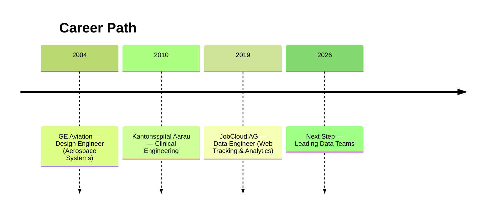

# Giovanni's Résumé

Welcome to the data version of my professional story that is modular, versioned, and open for exploration.  
Here you’ll find tailored views of my experience, projects, and career evolution.

---

**{{ cv.title }}**  
{{ cv.location }}  
📧 [{{ cv.email }}](mailto:{{ cv.email }})  
📞 {{ cv.phone }}

---

## Summary

{{ cv.summary }}

---

## Professional Journey

<!--

-->



### {{ job.role }} — {{ job.company }}

*{{ job.years }}*


- {{ h }}
  



## Education



- **{{ ed.program }}**, {{ ed.institution }} ({{ ed.years }})
  


## Personality at Work

> “Giovanni is both analytical and open — he thrives where logic meets creativity.”

- Quick to decide, yet thoughtful in judgment.
- Flexible problem solver with humor and optimism.
- Likes turning complex technical data into accessible stories.

---
Jump to [Projects](../projects/index.md)
