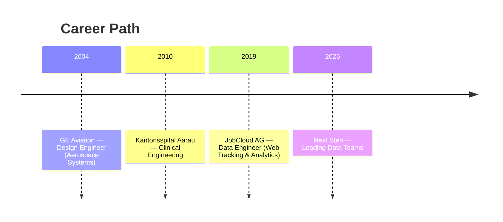

# CV

Welcome to the data version of my professional story — modular, versioned, and open for exploration.  
Here you’ll find tailored views of my experience, projects, and career evolution.

---

## Snapshot

**Name:** Giovanni López  
**Title:** Data Professional / Emerging Analytics Lead  
**Location:** Zürich, Switzerland  
**Languages:** English, German, Spanish  
**LinkedIn:** [giovlopez](https://www.linkedin.com/in/giovlopez/)  
**GitHub:** [gio-data-pro](https://github.com/gio-data-pro)  

## Summary

{{ cv.summary }}

---

## Professional Journey



### {{ job.role }} — {{ job.company }}

*{{ job.years }}*

- {{ h }}



## Education


- **{{ ed.program }}**, {{ ed.institution }} ({{ ed.years }})


## Personality at Work

> “Giovanni is both analytical and open — he thrives where logic meets creativity.”

- Quick to decide, yet thoughtful in judgment.
- Flexible problem solver with humor and optimism.
- Likes turning complex technical data into accessible stories.
  