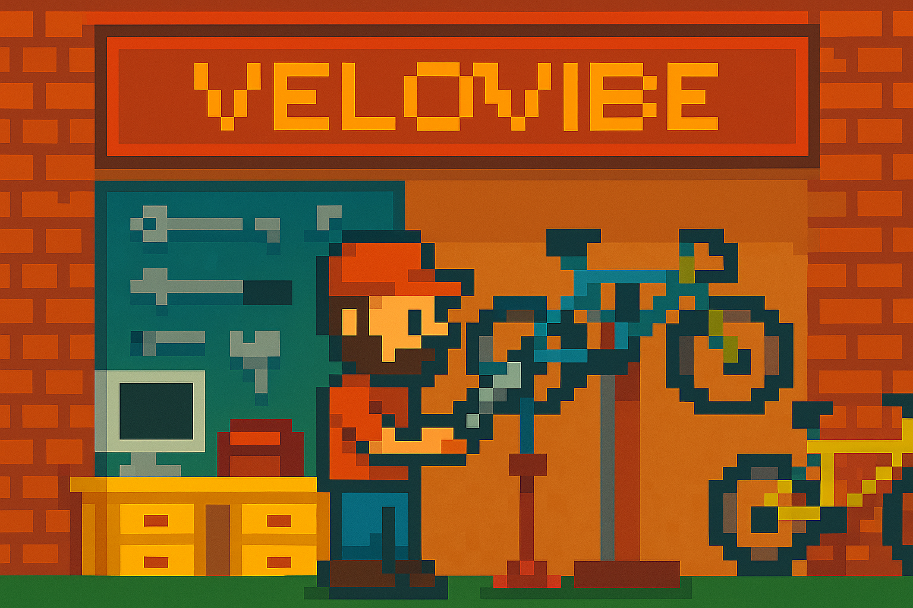
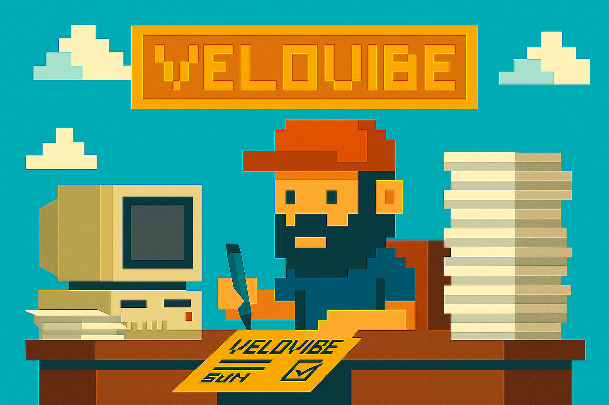
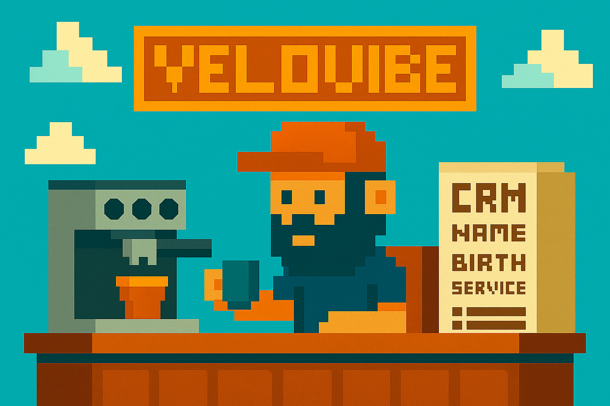

# The Web Analytics Tools War

## Lessons from a Well-Run Bike Shop

> *Whatever tools are in place, the quality of the recollection matters. Functional, true, and reliable beats shiny every time.*
>> *Or any cold and chilly run at night will always beat the best ever indoor cycling trainer session! :smile:*

This is an strategic/architecture thinking exercise... when doing POC's of web analytic tools in the past I have always thought of how to relate the online plaforms tracking solution design to actual physical entities.

Kind of an object oriented programming applied to web analytics :smile:. So here we go, following my beloved recurrent theme, I will use a physical **Bike Shop** as a metaphor medium. We are going to explore a few of the commercial tools out there, but put a different name on it, anyone you like or adore, the point is, the stack is most of the times not a just single tool, app or artifact powering analytics.

---

## The Business Case

> *Why the Bike Shop Needed Clarity*

Our fictional company, **VeloVibe**, runs a thriving bike shop near Bülach, ZH.  
Bikes gleam in the window, the workshop buzzes, and the local club wears our jerseys proudly.  
But the owner has a nagging feeling: despite all the action, nobody really knows *what’s driving the business*.

- Are most new riders coming from social media or local events?  
- Which service offerings keep customers coming back?  
- And how can we tell if our online shop and in-store experience are actually working together?

Like many organizations, VeloVibe already had tools, Google Analytics, Umami (for the poor), or any other flavor, some product dashboards, a CRM (or a big excel spreadhseet, for the poor) full of loyal customers, yet each told a different story.  

The goal here, thinks the owner, I don't want to buy more tools. If some how I can make the existing ones *speak the same language*.

---

## The Guided Tour

> *A Day in the Analytics Bike Shop*

Let’s walk through the shop and meet our “tools.”

### 1. The Front Window

> [Google Analytics 4 (GA4)](https://developers.google.com/analytics){:target="_blank"} 

Every passerby who stops to admire the bikes leaves a trace, think of a **session**, a **click**, a **scroll**.  
GA4 is that **front window counter**, quietly tracking foot traffic, popular models, and test-ride interest.  
It sees the crowd but not their names — perfect for understanding *what attracts attention and how people move around*.

- **Strength:** Broad view of all web and app interactions.  
- **Limitation:** It counts the crowd but doesn’t always tell you *who* they are or *why* they came.  
- **Analogy:** Great at counting helmets, not faces.

---

### 2. The Workshop

> [Amplitude](https://amplitude.com/){:target="_blank"}

Once customers are inside, Amplitude steps in, think of the **mechanic’s notebook**.  
It tracks every wrench turn: which bike parts are tested, which gears people love, where friction appears.  
This is **product analytics** in action, that is turning customer journeys into *stories of behavior*.

- **Strength:** Deep insights into product usage and retention.  
- **Limitation:** Needs clean, structured event data from the start.  
- **Analogy:** Perfect for tuning bikes, less for spotting who’s browsing outside.

---

### 3. The Club Tent

> [Adjust](https://www.adjust.com/){:target="_blank"}

Just outside the shop sits the **club tent**, where we sponsor rides, hand out flyers, and post on social media.  
Adjust measures how those activities bring riders back to the shop, it’s our **mobile attribution and campaign tracker**.  
It spots which ad, post, or event brought which cyclists, and helps us avoid being fooled by “phantom installs.”

- **Strength:** Strong for mobile campaign ROI and ad fraud prevention.  
- **Limitation:** Focused on acquisition; needs others to tell the retention story.  
- **Analogy:** Knows who showed up to the group ride, not who kept riding.

---

### 4. The Back Office

> [Segment](https://segment.com/){:target="_blank"}

Behind the counter, the back office hums with activity.  
Segment acts like the **shop manager**, gathering every receipt, order, and contact into one clean ledger.  
It routes customer data from the CRM, the website, the email platform, and even the workshop logs ensuring everyone works from the same, unified customer record.

- **Strength:** Excellent at unifying and distributing data across tools.  
- **Limitation:** Adds cost and requires governance discipline.  
- **Analogy:** The nervous system of the shop, that is, no glory whatsoever, but nothing works without it. Like road bikes, a neccesary evil :smile:

---

### 5. The Newsletter & Loyalty Desk

> CRM + Email Automation

Next to the espresso machine sits the CRM, full of names, birthdays, and service reminders.  
It’s where marketing turns *data* into *relationships*.  
A good CRM powered by clean data (thanks to Segment or GA4 exports) can recommend the perfect tune-up timing or next upgrade.  
This is where personalization starts, but only if the upstream data is trustworthy.

---

### 6. The Warehouse

> Data Platform & BI Layer

Out back, there’s a large warehouse, think of shelves filled with logs, transactions, and tracking exports.  
This is your **data warehouse or lakehouse**, the foundation where analytics, AI, and reporting all pull their materials.  
Tools like Snowflake, BigQuery, Redshift or any other DB/ETL/ELT tool out there, put everything together.  
From here, dashboards and predictive models emerge — the *inventory system of insight*.

---

### 7. The Shop Floor Flow

> Data Architecture View

Everything feeds into everything else, but only if each piece is configured and maintained like a tuned drivetrain.
This is, imo, one big crux, where every single company dealing with tracking data will struggle at some point.

---

## What the Shop Learned

After a few months of alignment, the VeloVibe team realized:
they didn’t need new analytics platforms, it turns out they needed **trust, cadence, and collaboration**.

- GA4 and Adjust handled **traffic and campaigns**.
- Amplitude gave **product engagement insights**.
- Segment stitched it all together.
- The CRM and warehouse added **business continuity and intelligence**.

With dashboards running off unified datasets, the owner could finally answer questions like:

> “How many riders from last month’s newsletter booked a service appointment *and* clicked on a new bike model?”

That’s the moment when analytics stops being an expense and starts being a habit.

---

## A Simple Decision Framework

> The Mechanic’s Checklist

When evaluating or combining tools, ask three playful but powerful questions:

| Step | Question                                   | Purpose                                                           |
| ---- | ------------------------------------------ | ----------------------------------------------------------------- |
| 1 | *What are we trying to observe?*           | Define the business goal before choosing the gauge.               |
| 2 | *Which tools already collect this data?*   | Avoid duplication; integrate instead of replacing.                |
| 3 | *How reliable is our current measurement?* | Clean, validated events beat any new subscription.                |
| 4 | *Who benefits from the insight?*           | Analytics value appears when teams act on the findings.           |
| 5 | *How do we stitch the story together?*     | Ensure tracking, routing, and storage align like chain and gears. |

---

## The Takeaway

Running analytics is like running a good bike shop:
you don’t need every shiny tool on the wall, you need the right ones, maintained with care, and shared by a team that understands how to use them.

> **Reliable, functional, and validated data across domain experts will always beat a shiny, underused platform.**

---

### Next Steps (for the curious mechanic)

- Add a technical annex: how event schemas and tracking plans fit into this architecture.
- Map roles and responsibilities for each “department.”
- Extend the framework into a maturity model for analytics readiness.

---

**Giovanni López, Nov 2025, Written with curiosity, caffeine, a working OpenAI API Key, and a bike stand nearby.** :smile:

---
Navigation on the left sidebar, or back to [Projects Overview](../projects/index.md)