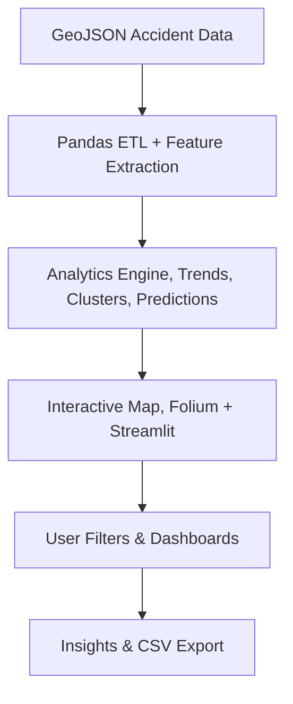

# Swiss Cycling Accident Data App

> When data meets the road safety.

---

## The Story

Every cyclist in Switzerland knows the beauty of the ride, and the unease of sharing narrow roads with traffic.  
After buildind [**MapAqua**](https://mapaqua.ch/), I wanted to look at cycling from another angle: **safety**.

While preparing for the [2025 Cycling Hack Zürich](https://cyclinghack.ch/events/zurich-2025/), I discovered the rich accident datasets available on [opendata.swiss](https://opendata.swiss/en/dataset/polizeilich-registrierte-verkehrsunfalle-auf-dem-stadtgebiet-zurich-seit-2011).  

The dataset was just rows and coordinates, powerful, but not visible. So I built **VeloCrash**, a **Streamlit** app that turns raw accident data into an interactive, story-driven map of Swiss cycling safety.

The goal:  
> Help riders, planners, and policymakers see where crashes happen, when they peak, and what patterns hide behind the noise.

---

## The Concept

**VeloCrash** is a **data visualization and analysis app** built with **Streamlit**.  
It transforms thousands of geolocated crash records into interactive maps, charts, and insights — with a focus on **cyclists and pedestrians**.

It’s not about blaming; it’s about *understanding*.  
Where are the blackspots? Which times are most dangerous? Are things getting better?

---

## Open Data

- **Source:** [opendata.swiss – Police-registered road traffic accidents (Zurich)](https://opendata.swiss/en/dataset/polizeilich-registrierte-verkehrsunfalle-auf-dem-stadtgebiet-zurich-seit-2011)  
- **GeoJSON format:** Thousands of accidents with coordinates, date, type, severity, and involved parties.  
- **SwissTopo WMTS** and **OpenStreetMap** layers for accurate geospatial context.

> Standing on the shoulders of open data, again.

---

## What the App Does

### Key Features

- 🗺️ **Interactive Maps:** Folium maps embedded in Streamlit with selectable base layers (SwissTopo, OSM, Terrain, Satellite).
- 🚴 **Cyclist Safety Dashboard:** Dedicated panel focusing on cycling and pedestrian crashes.
- 🔍 **Clustering:** DBSCAN algorithm identifies **blackspots** — high-density crash areas.
- 📈 **Temporal Analysis:** Trends by year, weekday, and hour, uncovering seasonal risk patterns.
- ⚡ **Predictive Analytics:** Early prototype for risk forecasting — time and location-based.
- 📊 **Export Options:** CSV and Plotly chart export for deeper analysis.

---

## How It Works (Under the Hood)

| Layer                | Description                                                                     |
| -------------------- | ------------------------------------------------------------------------------- |
| **Frontend**         | Streamlit app with sidebar filters, multi-tab layout, and Plotly visualizations |
| **Map Engine**       | Folium maps with overlays for heatmaps, blackspots, and severity                |
| **Backend**          | Pandas + Scikit-learn pipeline for cleaning, clustering, and analysis           |
| **Caching**          | Streamlit’s `@st.cache_data` decorator for performance optimization             |
| **Prediction Logic** | Risk model using time-of-day and historical accident frequency                  |

---

## Insights & Impact

| Perspective       | Finding                                                                     |
| ----------------- | --------------------------------------------------------------------------- |
| **Temporal**      | Peak crash hours: 7–9 a.m. and 4–6 p.m. — commuter traffic.                 |
| **Spatial**       | High-density zones near tram crossings and major intersections.             |
| **Trend**         | Gradual improvement post-2020 — likely linked to new cycling lanes.         |
| **Practical Use** | Riders plan safer routes; city planners identify infrastructure priorities. |

The dashboard makes data approachable — not just for analysts, but for everyday riders, journalists, and policymakers.

---

## Example View

---

## Tech Stack

| Component     | Tools                                   |
| ------------- | --------------------------------------- |
| Data          | OpenData Swiss GeoJSON                  |
| Processing    | Pandas, NumPy, SciPy                    |
| Analytics     | Scikit-learn (DBSCAN), Fourier Analysis |
| Visualization | Streamlit, Plotly, Folium               |
| Base Maps     | OpenStreetMap, SwissTopo, CartoDB       |
| Hosting       | Streamlit Cloud                         |

---

## Future Ideas

- 🧭 **Smart routing:** Recommend safer cycling routes using risk prediction.
- 🌦️ **Data enrichment:** Correlate crash data with weather, events, and daylight.
- 🧍 **Human factors:** Include rider demographics or equipment data.
- 📱 **Native app:** Bring real-time alerts to mobile devices.
- 🏙️ **Policy dashboards:** Help cities monitor impact of new bike lanes and traffic measures.

---

## Outcome

- Shared at **Cycling Hack Zürich 2025**, highlighted as a creative use of open data for public good.
- Used by cycling communities and local data enthusiasts.
- Demonstrates how **Python + Streamlit + Open Data** can make civic insights *beautifully accessible*.

---

> **VeloCrash** reminds us that behind every data point is a story,
> and that better data can lead to safer rides for everyone.

---
Navigation on the left sidebar, or back to [Projects Overview](../projects/index.md)
