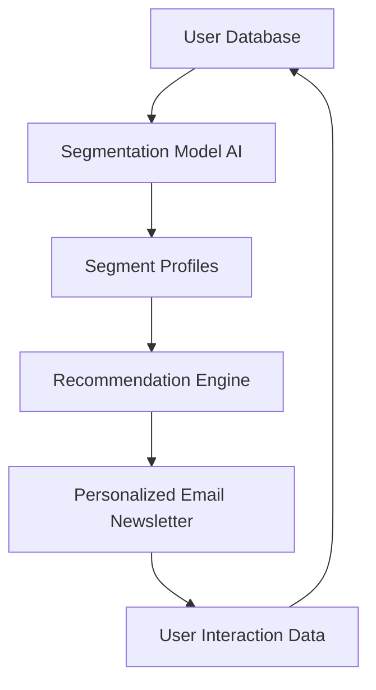
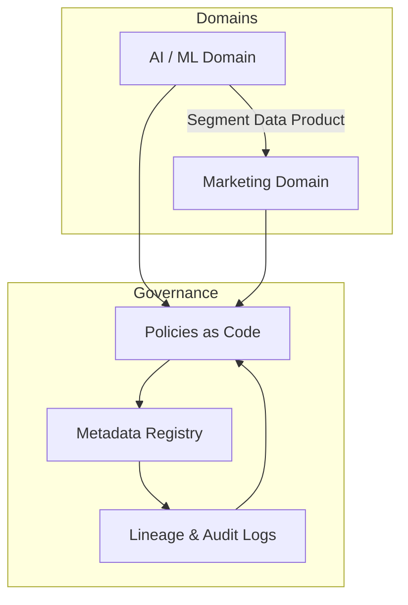

# Data Mesh Governance
> Freedom with Guardrails

**Duration:** Ongoing Initiative  
**Scope:** Company-wide data governance framework for AI and analytics products  
**Use Case:** Product recommendation system powered by AI-based user segmentation  

---

## The Starting Point

The company wanted to **accelerate its AI capabilities**, beginning with a product recommendation system.

The idea was simple:  
> *“Let’s use AI to understand our customers better — and send them smarter, more relevant product suggestions.”*

But beneath that simplicity lay a complex truth:

- We were handling **personal data (PII)**.  
- The algorithms might introduce **bias**.  
- Regulations like GDPR and new **AI compliance frameworks** demanded transparency.  
- The data teams wanted **speed**, while risk and legal needed **control**.

So, how do you let innovation sprint without running off a cliff?

---

## The Governance Challenge

In traditional data setups, control is centralized: one gatekeeper team checks everything.  
That works — until you need 10 AI experiments running in parallel.

We adopted a **data mesh governance model**:  
> **Every domain owns its data — but agrees to play by shared rules.**

Think of it like city traffic:

- Each driver controls their car (domain autonomy).  
- But everyone follows the same traffic lights, lanes, and speed limits (governance).  
- The city’s traffic system ensures flow *and* safety.

---

## The Use Case: AI-Driven Product Recommendations

Here’s what we wanted to build:

**Goal:**
Use machine learning to group users by behavior and preferences, then recommend products in newsletters that align with those segments.

---

## Where Governance Steps In

| Area                   | Question We Asked                                         | Governance Mechanism                                                     |
| ---------------------- | --------------------------------------------------------- | ------------------------------------------------------------------------ |
| **Privacy (PII)**      | Are we using personal data responsibly?                   | Mask or hash identifiers; segment on behavioral data, not names.         |
| **Bias & Fairness**    | Are certain user groups under- or over-represented?       | Bias audit pipeline, monitored like a “model health check.”              |
| **Transparency**       | Can we explain why someone got a specific recommendation? | Model card and data lineage log; every feature traceable.                |
| **Consent**            | Did users opt in to receive AI-based recommendations?     | CRM integrates consent flags; model filters out non-consenting users.    |
| **Access Control**     | Who can view or modify training data?                     | Role-based permissions + data product contracts.                         |
| **Quality**            | Are datasets consistent and documented?                   | Validation tests at data product level (schema, freshness, null checks). |
| **Speed & Innovation** | How do we let teams experiment safely?                    | “Sandbox” environments with synthetic or anonymized data.                |

---

## How the Mesh Model Helps

In our hybrid data mesh:

* The **AI Team** is a **data product owner** of the segmentation model.
  They define what goes in (inputs), what comes out (segments), and publish their schema and documentation.

* The **Marketing Team** owns the **Email Recommendation Product**, consuming segments as input and producing click and conversion metrics as output.

* The **Data Governance Team** doesn’t approve every experiment — they define and automate the **rules of the road**:

  * automated checks for PII in training data
  * bias detection reports
  * metadata registry with versioned model cards
  * access logs and lineage tracking

This ensures everyone drives fast — but stays in lane.

---

## Key Components

| Layer                   | Description                                                                                         |
| ----------------------- | --------------------------------------------------------------------------------------------------- |
| **Policies as Code**    | Automated checks for privacy, bias, and data quality embedded into CI/CD pipelines.                 |
| **Metadata Registry**   | Central index of all data and model products — who owns them, what data they use, when they update. |
| **Model Cards**         | Human-readable documentation for every AI model: purpose, inputs, outputs, limitations.             |
| **Consent Integration** | CRM-linked filters ensure only opted-in users enter personalized workflows.                         |
| **Audit Trail**         | All transformations logged; any recommendation can be traced back to source data and model version. |

---

## A Simple Metaphor

Imagine the company as a **large kitchen**:

* Each team is a chef with their own recipe (data product).
* The shared pantry (data platform) has labelled, clean ingredients.
* The head chef (governance) doesn’t cook for everyone — they just make sure the ingredients are fresh, safe, and stored correctly.
* Creativity thrives because hygiene is non-negotiable.

That’s **data mesh governance** — not about slowing people down, but making sure everyone can cook safely and proudly share the meal.

---

## Outcome

* **AI product speed increased** — teams launched new models 40% faster with less bureaucracy.
* **Regulatory compliance embedded** — privacy and bias checks automated.
* **Shared vocabulary established** — business, legal, and tech now speak the same governance language.
* **Trust restored** — leadership confident that innovation won’t create risk headlines.

---

## What’s Next

* Roll out **AI model registry** integrated with MLOps pipelines.
* Add **continuous bias monitoring** on live data.
* Extend governance to **external data partnerships** (vendors, APIs).
* Publish an internal **“AI Ethics Playbook”** — written in plain language, not legalese.

---

> *Good governance isn’t about control. It’s about creating the conditions for safe creativity — where data and AI can move fast, responsibly, and with purpose.*

---
Navigation on the left sidebar, or back to [Projects Overview](../projects/index.md)
