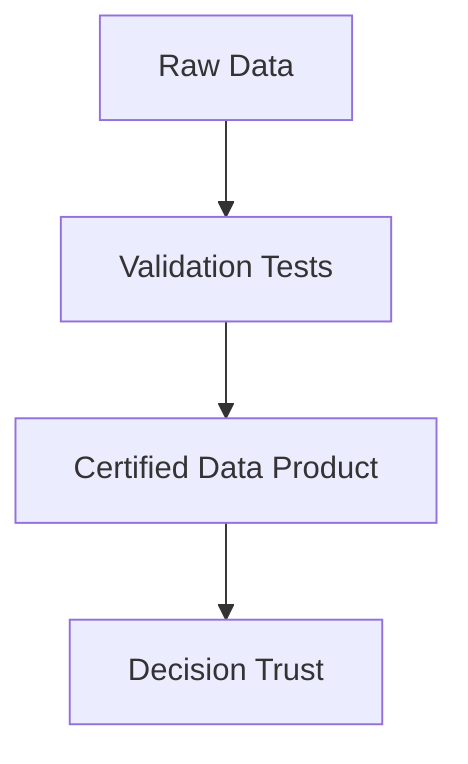
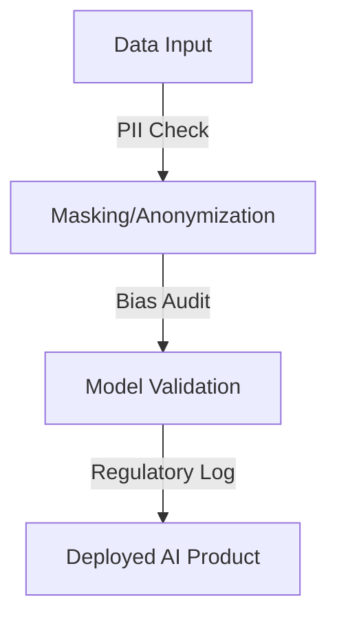

# Governance Principles

> Safe Speed for Smart Data

Good governance doesn’t mean bureaucracy.  
It’s like a mountain trail: the signs, maps, and guardrails don’t stop the ride —  
they just make sure everyone gets to the summit safely.

Here are the four playful pillars guiding every data and AI initiative:

---

## 1. Trust — The Compass
> *“If you can’t trust it, you can’t use it.”*

- Every dataset, model, or dashboard starts with reliability.  
- Metadata, tests, and lineage are our compass — pointing north to data truth.  
- When teams know the source and quality, they act faster with confidence.  

---

## 2. Autonomy — The Pedal Power

> *“Everyone can ride, but stay in your lane.”*

* Each team owns its own data product — they steer, brake, and accelerate.
* Governance provides the lanes, signals, and speed limits.
* Freedom + structure = flow.

| Autonomy Enablers     | Description                                        |
| --------------------- | -------------------------------------------------- |
| Domain ownership      | Teams publish and maintain their own data products |
| Shared standards      | Naming, schema, contracts agreed company-wide      |
| Decentralized tooling | Teams choose tools; governance sets guardrails     |

---

## 3. Compliance — The Helmet

> *“Because riding smart is better than riding sorry.”*

* Privacy, bias, and regulatory checks are built into the ride — not an afterthought.
* Policies are automated (Policies-as-Code) to keep speed without risk.
* Consent and fairness are just as measurable as revenue.

---

## 4. Transparency — The Trail Map

> *“Everyone should see how the trail was built.”*

* Every model, dataset, and transformation is documented.
* Model cards, lineage maps, and change logs form our open trail network.
* When you can trace every curve, detour, and elevation — trust grows.

| Transparency Tools | Purpose                           |
| ------------------ | --------------------------------- |
| Model cards        | Describe how and why models work  |
| Lineage view       | Show where data comes from        |
| Metadata registry  | Who owns what and when it updated |

---

### The Mantra

> **Move fast, see clearly, stay safe.**

Governance isn’t about slowing down the data adventure —
it’s about keeping the journey open, honest, and worth repeating.

---
Navigation on the left sidebar, or back to [Projects Overview](../projects/index.md)
