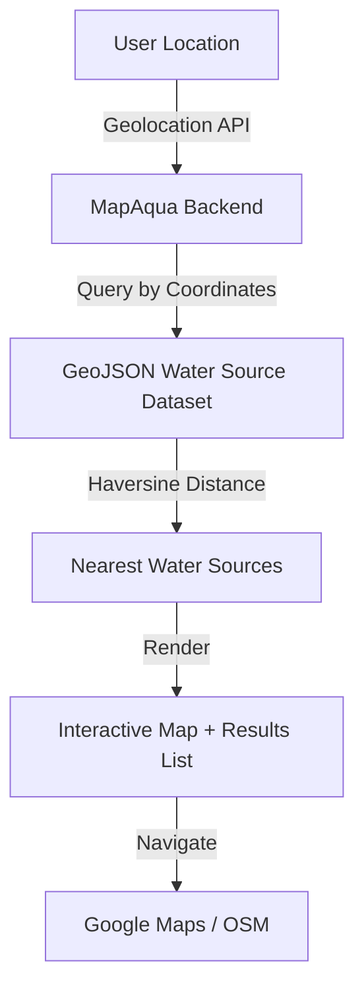
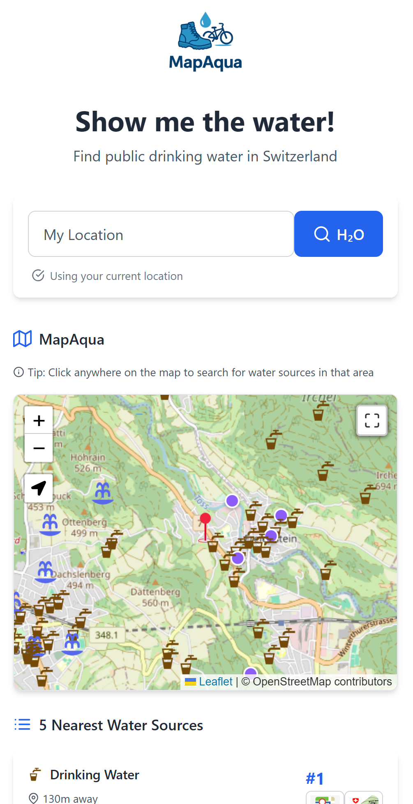

# MapAqua — Show Me the Water!

> *Standing on the shoulders of open data.*

---

## The Story

It all started with a phone call.  
Actually, about **ten** of them.

Last summer, my niece was riding her bike from Zürich to Lugano — a long, hot multi-day adventure through the Alps.  
Every few hours, she would call or text:  
> “Uncle Gio! Where’s the next water fountain?”  

Switzerland has around **40,000 public drinking water sources**, but even sitting comfortably at my desk, I struggled to find them quickly.  
OpenStreetMap had the data, SwissTopo had the maps — but connecting those dots in real time was like trying to refill a bottle under a dripping tap.  

So, I decided to build **MapAqua** — a simple, friendly web app that helps cyclists, hikers, and explorers find the nearest drinking water source anywhere in Switzerland.

---

## The Concept

**MapAqua** is a lightweight **Flask + Open Data** web app that lets users:

- Detect their current location  
- Find nearby **public drinking water sources**  
- See them on a map  
- Navigate directly to them via Google Maps or OSM  

It’s like a digital *“Hey, where’s the next fountain?”* assistant for the outdoors.

---

## Data & Open Collaboration

MapAqua exists thanks to open data and open collaboration:

- **OpenStreetMap (OSM)**: For all water source coordinates and tags  
- **SwissTopo**: For terrain reference and navigation context  
- **LeafletJS**: For interactive maps  
- **GeoJSON + Python**: To pre-process and serve 500k+ features efficiently  

> “Standing on the shoulders of open data” means acknowledging the power of public, shared data ecosystems — and giving them life through practical tools.

---

## How It Works

### Behind the Scenes

* The **browser** fetches user coordinates (with consent).
* The **Flask backend** calculates distances to all water sources using the **Haversine formula**.
* A **grid index** optimizes lookup within a bounding box around the user.
* The **nearest 5 sources** are displayed in real time — each with distance, type, and navigation link.

---

## Tech Stack

| Layer    | Tools                                      |
| -------- | ------------------------------------------ |
| Backend  | Flask, Python, GeoJSON, Haversine math     |
| Frontend | HTML5, JavaScript (Fetch API), TailwindCSS |
| Mapping  | LeafletJS + OpenStreetMap layers           |
| Data     | OSM + SwissTopo open datasets              |
| Hosting  | PythonAnywhere / Replit prototype          |
| License  | Open Data Commons Attribution (ODbL)       |

---

## Example View

*(Yes, the logo has a cyclist with a water droplet — because hydration is half the ride.)*

---

## Fun Numbers

* ~40,000 water sources across Switzerland
* Data compressed to ~40 MB GeoJSON
* Average response time under 200ms
* Tested on both **desktop** and **mobile** (it works mid-ride!)

---

## Outcome

* My niece made it to Lugano hydrated and happy.
* The app became a tiny open-data success story — used by hikers, cyclists, and curious travelers.
* Demonstrated how **small data apps** can make open data human and useful.

---

## Next Steps

* Multi-language support (DE/FR/IT/EN)
* Integration with **Komoot** or **Strava**
* User-contributed fountains via OSM links
* Elevation and ETA estimates for each point
* Partnership with **trinkwasser.ch** and local tourism offices

---

> **MapAqua** is proof that big data doesn’t have to be big —
> sometimes, it’s just a drop of code making life easier for someone on a hot day.

---
Navigation on the left sidebar, or back to [Projects Overview](../projects/index.md)
