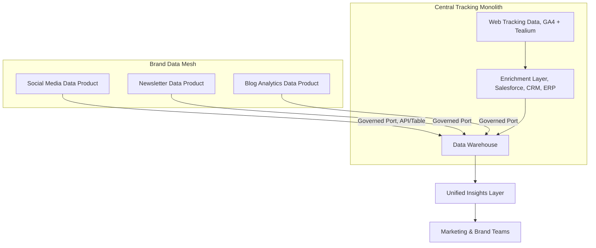
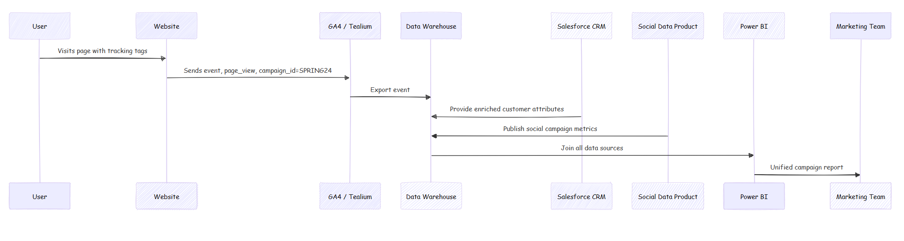

# Tracking Framework

> Hybrid Monolith + Mesh Architecture

**Duration:** Ongoing  
**Stack:** GA4, Tealium, AWS (Glue, S3, Redshift), Salesforce, Power BI  

**Goal:** Build a scalable tracking framework combining central governance with distributed ownership — integrating **web analytics**, **brand activities**, and **CRM/ERP enrichment**.

---

## The Context

As our organization’s marketing matured, data was pouring in from everywhere — websites, campaigns, newsletters, and social channels.  
The challenge: unify tracking without suffocating agility.

We designed a **hybrid architecture**:  

- a **centralized web tracking monolith**, owned by the Data Team  
- and a **distributed mesh of brand data products**, owned by channel specialists.  

Together they form a **living ecosystem**: structured where it matters, flexible where creativity happens.

---

## Core Idea

> Combine the reliability of a *central monolith* for event tracking with the autonomy of a *data mesh* for channel analytics.

---

## Architecture Overview

### 1. **Central Web Tracking (Monolithic Core)**

The **Data Team** owns the data pipeline for all web interactions:

* Tags and events defined centrally in **GA4/Tealium**.
* Events captured through a unified schema (`event_name`, `event_category`, `event_label`, `user_id`, `session_id`, etc.).
* Data extracted via API/ETL into the warehouse.
* Enriched using canonical sources from **Salesforce CRM** and **ERP master tables** (e.g., customer segments, subscription plans, region codes).
* Governed with data contracts and QA tests for every schema update.

This ensures **consistency and comparability** across all digital touchpoints.

---

### 2. **Brand Data Mesh (Distributed Edge)**

Teams responsible for **social media**, **email**, and **content marketing** became **data product owners**.
Each domain owns its data pipelines, logic, and visualization — but must expose a **data port** back to the central platform.

**Key principles:**

* Each team is a **producer** of a data product.
* They **define and document** their outputs (schemas, freshness SLAs, lineage).
* Data is exposed through governed interfaces — e.g., API endpoint, S3 bucket, or shared schema in Redshift.
* The **central data team consumes** this data for cross-channel analytics.

| Domain       | Example Source         | Data Product              | Consumer               |
| ------------ | ---------------------- | ------------------------- | ---------------------- |
| Social Media | Meta API, LinkedIn Ads | `social_campaign_metrics` | Central Data Team      |
| Newsletter   | Mailchimp              | `email_performance`       | Marketing Intelligence |
| Blog         | CMS + GA4              | `blog_engagement_events`  | Web & SEO Teams        |
| Web Tracking | GA4 / Tealium          | `session_events`          | Everyone               |

---

### 3. **Governance & Policy**

Hybrid governance keeps freedom *with boundaries*:

* **Infrastructure as Policy** — data access, schema validation, and QA automated through CI/CD pipelines.
* **Metadata Registry** — each data product registered with tags (owner, SLA, schema version, lineage).
* **Change Management** — schema updates must pass validation before merge.
* **Documentation Hub** — MkDocs-based data catalog (you’re looking at it 😉).

---

## Example Data Flow

A simplified example of how the system interacts for a campaign:

---

## Example Use Case: Cross-Channel Performance Dashboard

The unified warehouse allows a single view of **conversion funnels** across owned and paid channels.

| Channel      | Sessions | Conversions | Conversion Rate | Data Source     |
| ------------ | -------- | ----------- | --------------- | --------------- |
| Website      | 120,000  | 5,300       | 4.4%            | GA4             |
| Social Media | 80,000   | 3,600       | 4.5%            | Meta / LinkedIn |
| Email        | 25,000   | 1,100       | 4.2%            | Mailchimp       |
| Blog         | 45,000   | 800         | 1.8%            | CMS             |
| Total        | —        | —           | —               | Unified via DWH |

---

## Why Hybrid Works

| Strength    | Monolith                      | Mesh                      |
| ----------- | ----------------------------- | ------------------------- |
| Governance  | ✅ Central schema & QA         | 🟡 Team-level autonomy    |
| Scalability | 🟢 Easy to maintain pipelines | 🟢 Domain-specific growth |
| Agility     | ⚪ Slower to adapt             | 🟢 Quick iteration        |
| Ownership   | ⚪ Central only                | 🟢 Distributed            |
| Integration | ✅ Reliable joins              | 🟡 Requires coordination  |

**Result:**
A federated ecosystem where web tracking remains the backbone, and channel data products act as living satellites.

---

## Outcome

* **Unified insights** combining CRM-enriched web analytics and decentralized brand data.
* **Stronger data culture** — each domain became responsible for its own quality and documentation.
* **Scalable governance** — onboarding new channels no longer requires core pipeline redesign.
* **Transparency & trust** — data lineage visible end-to-end.

---

## Future Directions

* Introduce **Data Contracts as Code** for all channel products.
* Enable **real-time sync** for high-frequency social metrics.
* Extend **domain-level observability** (monitor freshness, drift, anomalies).
* Build **cross-domain attribution models** combining clickstream + engagement data.

---

> *This hybrid architecture showed that data maturity isn’t about choosing monolith or mesh — it’s about designing the right conversation between the two.*

---
Navigation on the left sidebar, or back to [Projects Overview](../projects/index.md)
